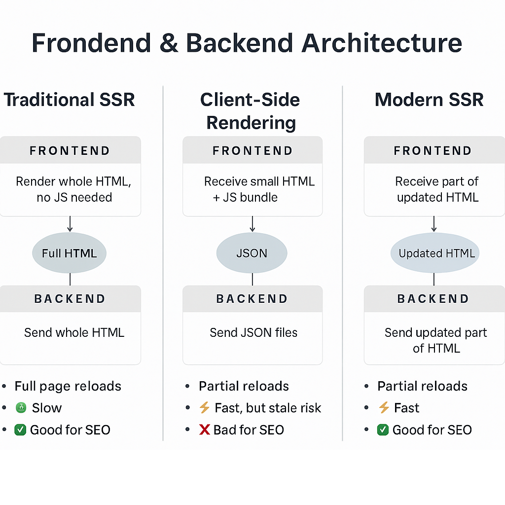

# Overview

Mosh's video was recorded in 2023 and Next.js and Tailwind have updated since then. Some features and configurations have already changed. This file records my learning notes.

## Intro video

The intro video (1h long, free version) contains following parts:

1. Routing and navigation
2. Client and server components
3. Data fetching
4. Caching
5. Static and dynamic rendering
6. Styling using globals.css
7. Styling using CSS modules
8. Styling using Tailwind CSS
9. Styling using DaisyUI

### Tailwind Installation

The installation method in the video is outdated. Follow the instructions in [Tailwind website](https://tailwindcss.com/docs/installation/framework-guides/nextjs) instead.

### DaisyUI

New theme should be added in globals.css instead of tailwind.config.ts.

## Routing and navigation

### Dynamic Routing

A dynamic route is a route with a parameter.

In the video, the parameter is used synchrounously, which triggers an Error in browser:

Server Error: Route "/users/[id]" used `params.id`. `params` should be awaited before using its properties.

To solve this problem, async and await are used, which is recommended in [Next.js website](https://nextjs.org/docs/messages/sync-dynamic-apis#possible-ways-to-fix-it) since the warning occurred on a Server component.

After adding async and await, a hint shows on await keyword saying "await has no effect on this type of expression". This doesn't affect dev mode but causes an error in production.

To solve this problem, follow [Next.js website's](https://nextjs.org/docs/app/building-your-application/routing/dynamic-routes#typescript) instruction to add a Promise type in the Props.

### Catch All Segments

Create products/[[...slug]] path and page.tsx file.

[[]] means the parameters are optional, ... means it can accept varying number of parameters.

Renaming [...slug] causes an error, so deleting and recreating is a better way.

### Accessing Query String Parameters

Modify UserTable.tsx, /users/page.tsx. Here, Server Side Rendering (SSR) is used, not Client Side Rendering (CSR) in game-hub project.

#### Traditional SSR, CSR and modern SSR

1. Traditional SSR

   Frontend: Receives a full HTML page from backend

   No need for JavaScript (though it can be added)

   Rendering is handled by the browser

   Backend: Generates and sends full HTML pages

   Features:
   <ul>
    <li>Good SEO</li>
    <li>Full page reloads, slow perceived performance</li>
    <li>Simple, no hydration issues</li>
   </ul>

2. Client-Side Rendering

   Frontend: Receives minimal HTML + JS bundle, builds UI in browser

   Backend: Sends JSON data only via APIs, Decoupled backend using REST or GraphQL

   Features:
    <ul>
    <li>Poor SEO</li>
    <li>No full page reloads, good perceived performance</li>
    <li>Fast but stale risk, UI may show old data if you don't revalidate or re-fetch at right time</li>
   </ul>

3. Modern SSR

   Frontend: Receives a full HTML page initially (pre-rendered or server-rendered)

   On navigation, only the changed parts of the page are sent (thanks to React Server Components)

   Runs a small JS runtime for client-side navigation and hydration

   Backend: Sends HTML (full or partial) generated on the server, fetch fresh data server-side

   Feature:

   <ul>
    <li>Good SEO</li>
    <li>No full page reloads, good perceived performance</li>
    <li>Fast and no stale risk</li>
    <li>Fresh data because rendering happens on every request </li>
   </ul>

#### Framework summary by architecture

| Architecture        | Frontend Frameworks                       | Backend Frameworks                                                          |
| ------------------- | ----------------------------------------- | --------------------------------------------------------------------------- |
| Traditional SSR     | (Browser renders HTML)                    | Ruby on Rails, Django, Laravel, ASP.NET, Spring Boot (with templates)       |
| CSR                 | React, Vue, Angular, Svelte, React Router | Spring Boot, Micronaut, Express.js, NestJS, Django REST, Flask, public APIs |
| Modern SSR (Hybrid) | Next.js 13+, Nuxt 3, Remix                | Next.js (backend built-in), Nuxt (backend built-in)                         |

#### Summary picture

This picture was generated by ChatGPT.

#### Summary table

| Concept                     | My Project (App Router)      | Traditional SSR      | CSR (SPA style)             |
| --------------------------- | ---------------------------- | -------------------- | --------------------------- |
| Who intercepts link clicks? | Next.js client runtime       | Browser              | Client-side router          |
| Where is rendering done?    | Server via Server Components | Server (entire page) | Browser (React)             |
| Does it reload whole page?  | ❌ No                        | ✅ Yes               | ❌ No                       |
| Data fetching               | Server                       | Server               | Client                      |
| SEO                         | ✅ Great                     | ✅ Great             | ❌ Poor (unless hydrated)   |
| Speed & UX                  | 🚀 Fast & smooth             | 🐢 Slow & janky      | ⚡️ Fast but freshness risk |

### Layout

Create admin folder which contains layout and page. A Layout component should have a parameter called children of type ReactNode. This prop represents the nested content that will be rendered. More specifically, in a layout.tsx, children refers to:

1. page.tsx at the same level
2. page.tsx at a lower level (in a subfolder) without its own layout.tsx
3. layout.tsx at a lower level

For example, in app/layout.tsx, children means:

1. app/page.tsx
2. app/users/pages.tsx
3. app/admin/layout.tsx

While in app/admin/layout.tsx, children means: app/admin/pages.tsx. And when visiting /admin, the render tree is:

1. app/layout.tsx (root)
2. app/admin/layout.tsx (nested layout)
3. app/admin/page.tsx (nested page → becomes children of admin layout)

### Navigation

Link element in Next.js 13+:

only downloads the content of the target page, not the navigation bar or global css that applies to every page

pre-fetches links that are in the viewport

As we navigate in our app, Next.js stores the payload of our pages in a cache on the client. This cache only exists in one session and clears when we do a full page reload.

### Programmatic navigation

Take user to a new page as a result of clicking a button or submitting a form. Here we turn /users/new/page.tsx into a client componet because we want to make a form on this page, and we cannot handle browser events in a server component.

When importing router, import it from next/navigation instead of next/router. The latter is the old version (page router).

### Showing loading UIs

Add Suspense element around the target element, edit fallback attribute to define what users see when loading.

If we want to set loading UIs between different pages, we can:

1. in root layout.tsx, wrap children with Suspense
2. create loading.tsx under app folder

Loading file in child folder overrides loading file in parent folder.

| Navigation Target              | Which loading.tsx?               |
| ------------------------------ | -------------------------------- |
| /                              | app/loading.tsx                  |
| /users                         | app/users/loading.tsx            |
| /users/abc                     | app/users/loading.tsx            |
| no matching nested loading.tsx | Inherits from parent loading.tsx |

### Handling not found

If a not-found.tsx is put under app/ folder, it is responsible for handling localhost:3000/unknown.

If it is put under a subfolder, such as app/users, we need a [] or [[...slug]] subfolder and a page.tsx inside that folder to call notFound function. It is for handling localhost:3000/users/39.

### Handling errors

Creating an error.tsx in app/ folder can catch all errors. We can also create an error.tsx in a subfolder to handle all the errors happen in any of the routes under this subfolder.

The errors happen in layout.tsx cannot be detected by error.tsx. A global-error.tsx needs to be created under app folder.

To log error in real world, a tool called [Sentry](https://sentry.io/welcome/) is recommended.

We can pass a reset function to this error.tsx file to retry loading current page. If so, we need to set the component client side because we need to deal with onClick event.

## Build APIs

### Get a collection of objects

Create a subfolder api/users and a route.tsx. Use static data for now.

If the parameter request: NextRequest is deleted, Next.js caches the result of this response. So, even it's not used, we should keep it.

### Get a single object

Create a subfolder api/users/[id] and a route.tsx. Use static data for now.

### Create an object

In app/users/route.tsx, add a new POST function. Use Postman to test creating an object.

### Update an object

In app/users/[id]/route.tsx, add a new function. We can use PUT or PATCH. PUT replaces the entire object and PATCH only updates one or more properties.

First we check the validity of the request, then we check the validity of the id. If no error, we fetch and update the user object.

### Delete an object

In app/users/[id]/route.tsx, add a DELETE function.

### Validate requests with Zod

Introduce a validation library called [Zod](https://zod.dev), which used in React course too.

Create a schema.ts and define the structure of request.

schema.safeParse won't throw an error, only return an object, schema.parse will throw an error.

### HTTP status code

| Status | Name                  | Meaning / When to Use                                                                                                    |
| ------ | --------------------- | ------------------------------------------------------------------------------------------------------------------------ |
| 200    | OK                    | ✅ Successful GET, PUT, or DELETE request. The request was processed correctly.                                          |
| 201    | Created               | ✅ Resource was successfully created (used after POST).                                                                  |
| 204    | No Content            | ✅ Request was successful but no content to return (commonly used after DELETE).                                         |
| 400    | Bad Request           | ❌ Client sent invalid data (e.g. missing required fields, wrong data type).                                             |
| 401    | Unauthorized          | ❌ Authentication required — the user is not logged in.                                                                  |
| 403    | Forbidden             | ❌ User is logged in but does not have permission to perform the action.                                                 |
| 404    | Not Found             | ❌ Requested resource doesn’t exist (e.g. user with ID doesn't exist).                                                   |
| 409    | Conflict              | ❌ There’s a conflict — e.g. trying to create a user with an email that already exists.                                  |
| 422    | Unprocessable Entity  | ❌ Data is semantically incorrect (e.g. valid JSON structure, but invalid values). Often used in form validation errors. |
| 429    | Too Many Requests     | ❌ Rate limit exceeded — you're sending too many requests in a short time.                                               |
| 500    | Internal Server Error | ❌ Something went wrong on the server side — not the client's fault.                                                     |
| 503    | Service Unavailable   | ❌ Server is down or temporarily unable to handle the request (e.g. under maintenance).                                  |

Common CRUD usage example

| Action | Method | Response Code            | Notes                        |
| ------ | ------ | ------------------------ | ---------------------------- |
| Create | POST   | 201 Created              | New resource added           |
| Read   | GET    | 200 OK                   | Data retrieved successfully  |
| Update | PUT    | 200 OK or 204 No Content | Resource updated             |
| Delete | DELETE | 204 No Content           | Resource deleted, no content |

## Database integration

### Set up Prisma

| Tool                   | Purpose                                                                                                          |
| ---------------------- | ---------------------------------------------------------------------------------------------------------------- |
| MySQL Community Server | The actual database (your data lives here).                                                                      |
| DataGrip               | A UI/database client — like a fancy version of MySQL Workbench, can connect to many kinds of databases.          |
| Prisma                 | An ORM (Object Relational Mapper) — helps you interact with the database using TypeScript/JS instead of raw SQL. |

### Define models

Define a User model in schema.prisma file. Refer to [Prisma model](https://www.prisma.io/docs/orm/prisma-schema/data-model/models).

Run "npx prisma format" to format this file.

### Create migration

Every time we update the table or database, we run above command to keep database schema in sync with Prisma schema.

Command: npx prisma migrate dev

This code creates a migration folder under prisma folder. Inside this folder we can see the SQL commands.

Use DataGrip to connect, view and change table in the database.

### Create a Prisma client

In prisma folder, create a client.ts file. To avoid creating multiple clients in develop mode, refer to [the best practice](https://www.prisma.io/docs/orm/more/help-and-troubleshooting/nextjs-help#best-practices-for-using-prisma-client-in-development).

The PrismaClient is automatically imported from "@/app/generated/prisma", the import in the video and official doc are outdated.

### Get data

Go to users/route.tsx file, change the static data to the data in database. Use findMany function to get all users.

Go to users/[id]/route.tsx file, use findUnique to get user with given id.

### Create data

Go to users/route.tsx file, first we check whether the input email exists, if not, we create a new user object and return it.

### Update data

Go to users/[id]/route.tsx file, first we fetch the user with given id. If it exists, we update the email and name. I think here the real world case is more complex because we don't know which field(s) we have and we need to check and update given fields.

### Delete data

Similar to update. Here Mosh returns an empty object, while chatGPT recommends return the deleted user.

## Upload files

### Choose cloud platforms

Amazon S3, Google Cloud Platform, Microsoft Azure, Cloudinary. Here, Cloudinary is chosen because it integrates with Next.js and React better.

### Set up cloudinary

Command: npm install next-cloudinary. Then add my cloud name to .env file.

### Upload files

Use unsigned upload [widget](https://next.cloudinary.dev/clduploadwidget/basic-usage#unsigned) to create an upload button.

Create an upload folder and page.tsx.

### Show uploaded image

Add a state hook to store public_id from result. Define the result info as CloudinaryUploadWidgetInfo type so we can access the public_id field.

### Customize the upload widget

Refer to Cloudinary widget [website](https://demo.cloudinary.com/uw/), adjust UI and copy the js code.

## Authentication

### Set up NextAuth

First install NextAuth.js using 'npm i next-auth'. Then, since we are using Next.js 13+, we refer to this page and create a app/api/auth/[...nextauth] folder and paste the code inside a route.ts file.

Then, we add NEXTAUTH_URL and NEXTAUTH_SECRET in dot env file.

### Configure Google provider

Refer to this [page](https://next-auth.js.org/providers/google).

Create a new Google Cloud project and configure the Branding, Audience, Clients and Data access.

### Understand authentication session

Go to Application-Cookies to view the session token under cookies. Cookies are small pieces of infomation that are exchanged between the client and server with each request.

View the JSON web token:

Create a token folder under auth and a route.ts file. Use getToken to get the token and go to /api/auth/token to view the token.

name, email, picture: the log in user's account info

sub: like the user ID

iat, exp: issued at and expires at what time, by defaut the period is 30 days

A JSON web token is like an identification card that the client sends to the server with each request.

When the user logs in, NextAuth creates an authentication session for that user. By default, it represents that session using a JSON web token.
